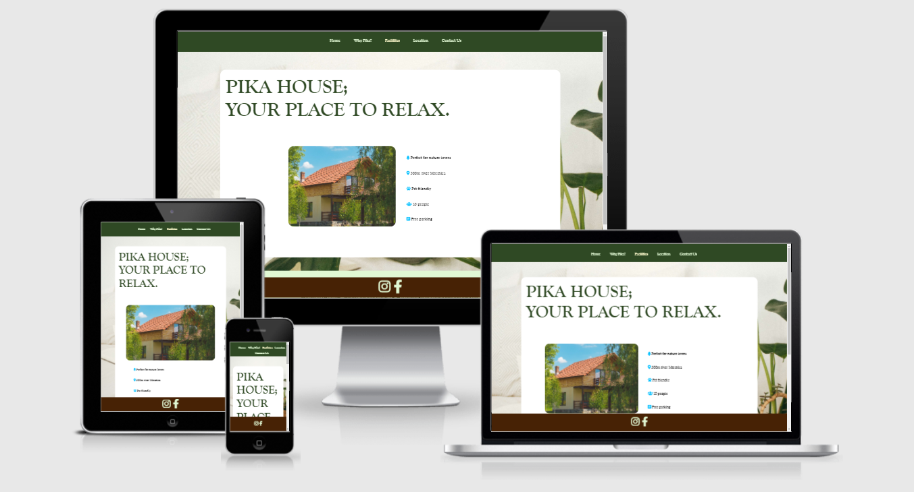
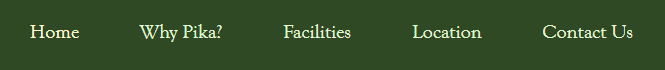
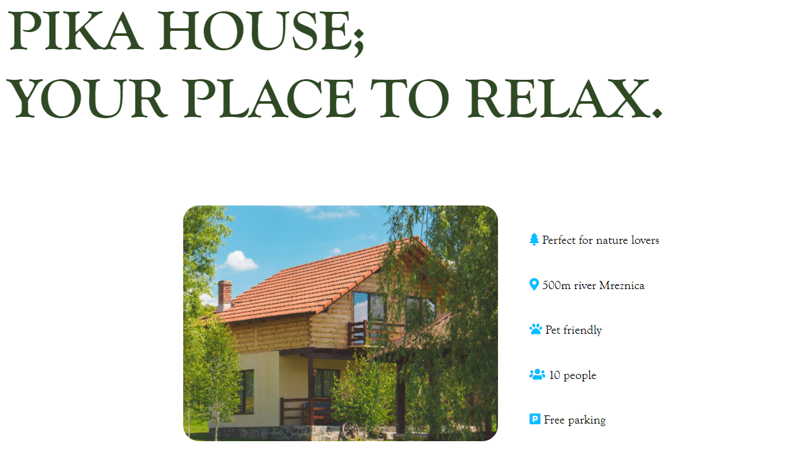
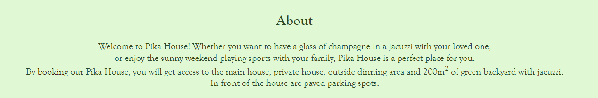
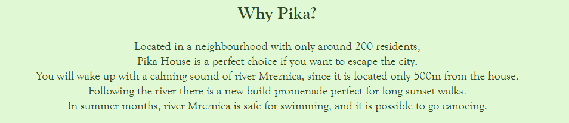
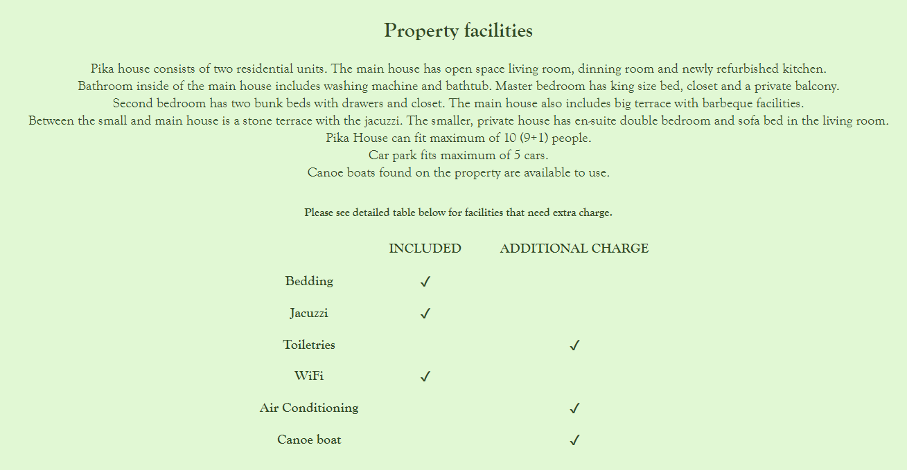
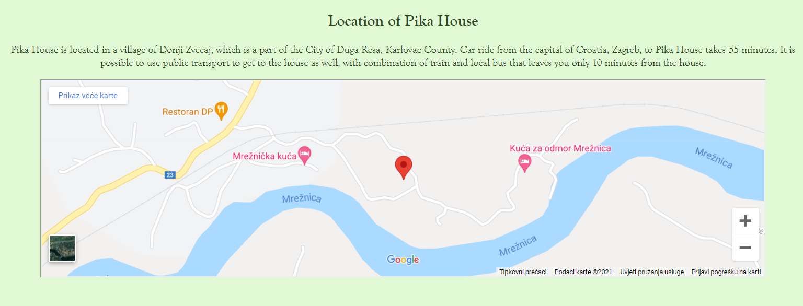
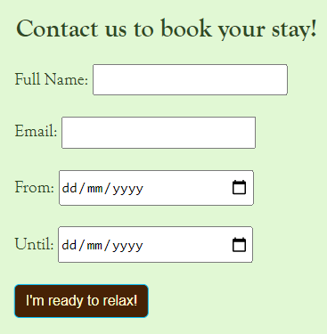
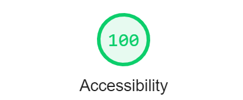

# Pika House
Pika House website is a page for any adult who is looking to book a quiet place for vacation.
On Pika House website, users can found out all the information needed before they decide to make a booking, including the description and location of the house, information about the landscape surrounding it, facilities included in price, and finally make a contact to book a property. The site is targeted for tourists who love to spend their time in nature and groups of family or friends.

## Features

* Navigation
    * Featured at the top of the page
    * Navigation links are in the center: Home, Why Pika?, Facilities, Location and  Contact Us which link to different sections of the main page and other 3 pages
    * Dark green background colour contrasts with the light green font colour
    * Navigation helps user to easily find information

* The Header
    * The Header shows the name of the website, image and a list of main specifications of the property
    * Name of the website matches the navigation colour
    * Bullets of the list match the image colour
    * This section provides the user with summary of main features and visual representation of the property

* About
    * This section provides general information about the property
    * Background light green colour contrasts with dark brown colour

* Why Pika House
    * This section shows information about the surroundings of the property
    * Shows the users which activities are possible to do in the area

* Facilities
    * This section has paragraph and the table
    * Paragraph is a detailed description of the house and outside area
    * Table shows which utilities need extra charge

* Location
    * This section has paragraph and an iFrame
    * Users can find out precise location and different options of transportation to the property

* Contact Us form
    * Contact section has a form to make a booking of the property
    * The form collects first and last name of the user interested in booking, email, and dates from when and until

* Footer
    * Footer has social media links that open in a new tab
    * Users can open [Instagram](https://www.instagram.com/) and [Facebook](https://www.facebook.com/) home page
    * User can immediately recognize social media webpages because of the font icons used
    * Dark brown background colour contrasts with light yellow font colour

## Bugs

### Solved Bugs
* While creating the navigation bar, links did not work
* The problem was in nested anchor and list item elements, list items were nested inside anchor tag
* I solved the problem by nesting the anchor tag inside the list items

### Testing

I tested that this page works in different browsers: Chrome, Opera, Edge
I confirmed that this project is responsive
I confirmed that that everything is readable and easy to understand
I have confirmed that the form works: requires input in every field, only accepts email in email field, and the submit button works

### Validator testing
* HTML
    * No errors were returned when passing through the official W3C validator
* CSS
    * No errors were returned when passing through the official Jigsaw validator
* Accessibility
    * I confirmed that the colours and fonts are easy to read and accessible when running it through lighthouse in DevTools

## Unfixed bugs
No unfixed bugs

## Deployment
* The site was deployed to GitHub pages. The steps are:
    *In the GitHub repository, navigate to Settings
    *Navigate to Pages, select the Master Branch from the source drop-down menu
    *The page provided link to the completed website
Live link can be found here [Pika House](https://mljubaj.github.io/pika_house/)

## Credits

### Content
Font was taken from [Font Awesome](https://fontawesome.com/) website

### Media
Background image and image in the header were taken from [Pexels](https://www.pexels.com/)
